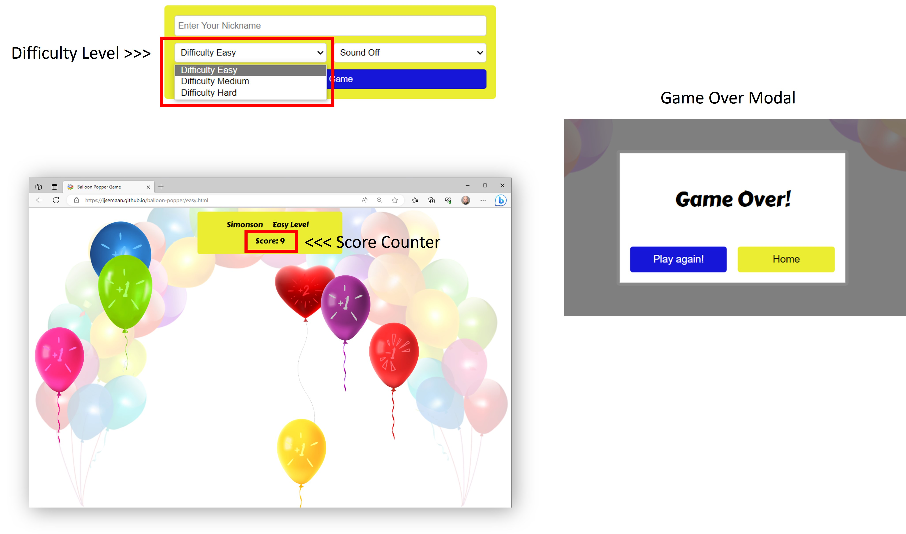
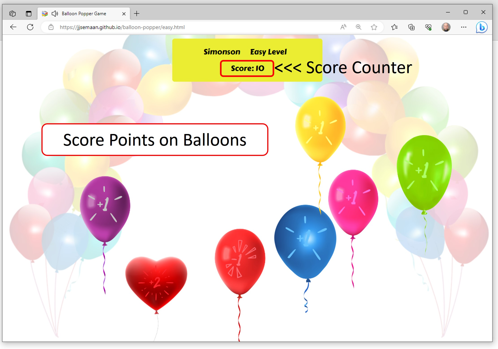

Balloon Popper Game

Experience Balloon Popping Fun in pop-tastic style!

PP2 Jalal Semaan

**[Live site](https://jjsemaan.github.io/balloon-popper/index.html)**

------------------------------------------------------------------

**[Repository](https://github.com/jjsemaan/balloon-popper.git)**

------------------------------------------------------------------

## Features

### Desktop and Mobile Devices

* Intuitive Homepage
  * Includes clear game title, playing instructions and an options form present in the centre of the screen.
  * The form captures and validates the player's preferred nickname and enables gaming options including preferred difficulty level and sound On/Off.
  * The form allows players to navigate intuitively between difficulty levels without any interruptions on any size device.
  * See below image of Home Page.

* Footer
  * Allows players to visit the developers website.

* Gaming pages
  * There are three gaming pages, one page representing each of the difficulty levels 'Easy', 'Medium' and 'Hard'.
  * Each gaming page includes a responsive top menu containing the player's nickname, difficulty level and score.
  * At the end of each game a modal pop up window with two buttons will appear providing the player with the option to either play again or go back to the homepage.
  * See below image.

* Sound
  * Sound is optional and user-enabled by a dropdown selector.
  * The sound option provides means to further engage with the game, balloon popping sounds deffer by the score associated with particular balloons colours. 
  * Accordingly, a red ballons sounds like an error and scores -1 point if popped, the red heart balloon sound like a double pop and scores +2 points when popped, whereas any other balloon colour sounds like a normal balloon pop and scores +1 point at a time. 

* Scoring
  * A score counter is visible on the top menu.
  * Scores '+1', '-1' and '+2' are graphically overlaid on their designate balloons to enable informed decision making the the player. 
  * See below image of ballons and score counter.

  

* Favicon
  * This will appear site-wide on the top left corner of the website tab in any browser to enable easy identification especially when multiple tabs are open.

* 404 Page
  * The 404 page will appear if a site visitor enters a broken link.
  * This page includes a home button that will take the visitor back to the home page.
  * The footer remains enabled in the 404 page with a hyperlink to the developers website.

