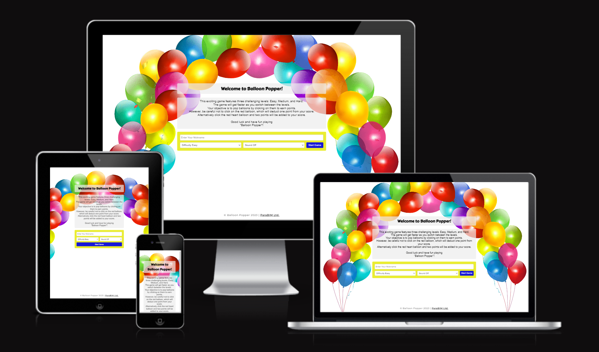
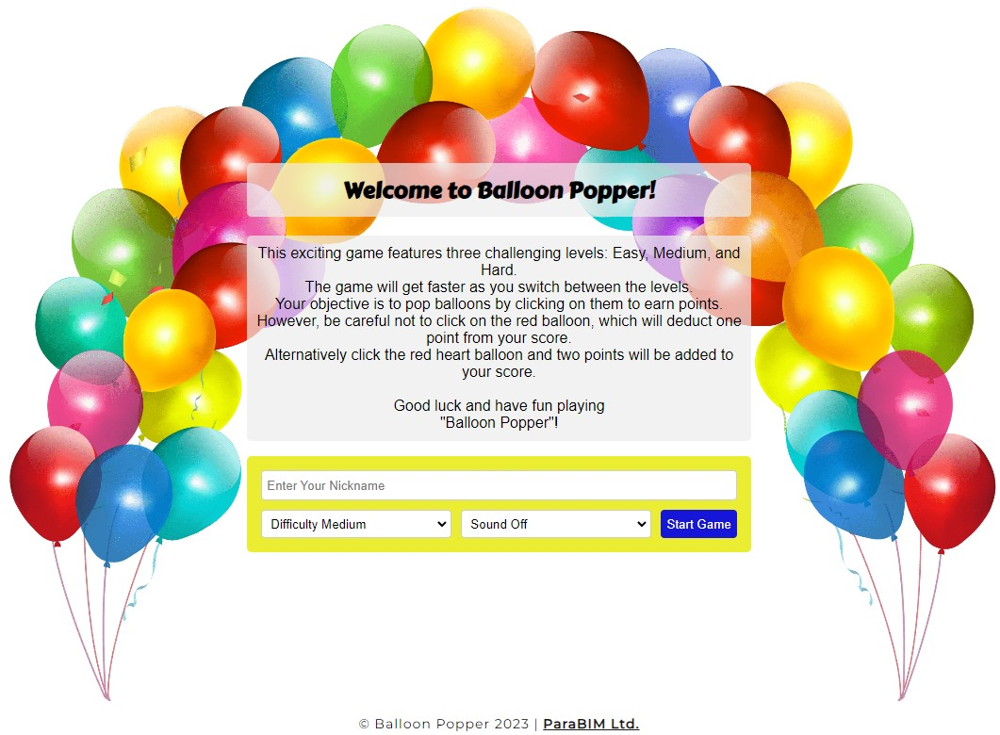
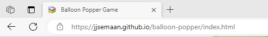
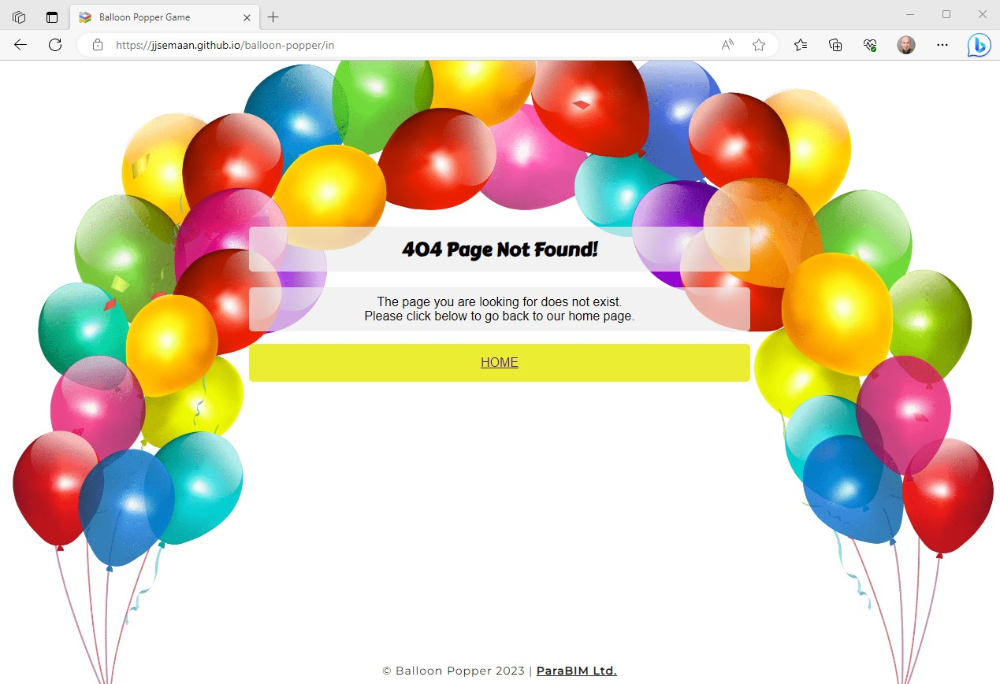

Balloon Popper Game

Experience Balloon Popping Fun in pop-tastic style!

PP2 Jalal Semaan

**[Live site](https://jjsemaan.github.io/balloon-popper/index.html)**

------------------------------------------------------------------

**[Repository](https://github.com/jjsemaan/balloon-popper.git)**

------------------------------------------------------------------

## Features

### Desktop and Mobile Devices

* Intuitive Homepage
  * Includes clear game title, playing instructions and an options form present in the centre of the screen.
  * The form captures and validates the player's preferred nickname and enables gaming options including preferred difficulty level and sound On/Off.
  * The form allows players to navigate intuitively between difficulty levels without any interruptions on any size device.
  * See below images of navigation menu.

* Footer
  * Allows players to visit the developers website.

* Favicon
  * This will appear site-wide on the top left corner of the website tab in any browser to enable easy identification especially when multiple tabs are open.

* 404 Page
  * The 404 page will appear if a site visitor enters a broken link.
  * This page includes a home button that will take the visitor back to the home page.
  * The footer remains enabled in the 404 page with a hyperlink to the developers website.

