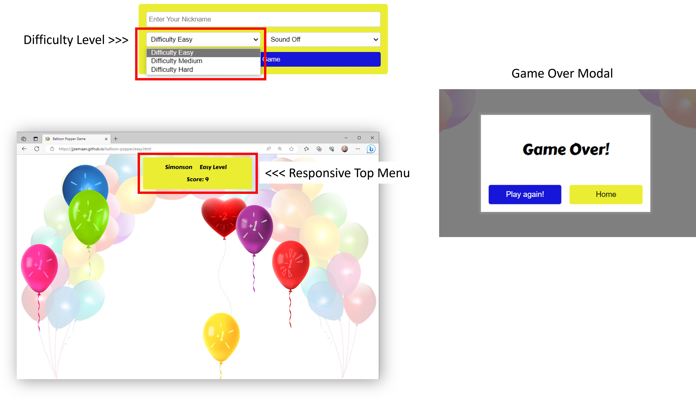

Balloon Popper Game

Experience Balloon Popping Fun in pop-tastic style!

PP2 Jalal Semaan

**[Live site](https://jjsemaan.github.io/balloon-popper/index.html)**

------------------------------------------------------------------

**[Repository](https://github.com/jjsemaan/balloon-popper.git)**

------------------------------------------------------------------

## Features

### Desktop and Mobile Devices

* Intuitive Homepage
  * Includes clear game title, playing instructions and an options form present in the centre of the screen.
  * The form captures and validates the player's preferred nickname and enables gaming options including preferred difficulty level and sound On/Off.
  * The form allows players to navigate intuitively between difficulty levels without any interruptions on any size device.
  * See below image of Home Page.

* Footer
  * Allows players to visit the developers website.

* Gaming pages
  * There are three gaming pages, one page representing each of the difficulty levels 'Easy', 'Medium' and 'Hard'.
  * Each gaming page includes a responsive top menu containing the player's nickname, difficulty level and score.
  * At the end of each game a modal pop up window with two buttons will appear providing the player with the option to either play again or go back to the homepage.
  * See below image.

* Sound
  * Sound is optional and user-enabled by a dropdown selector.
  * The sound option provides means to further engage with the game, balloon popping sounds deffer by the score associated with particular balloons colours. 
  * Accordingly, a red ballons sounds like an error and scores -1 point if popped, the red heart balloon sound like a double pop and scores +2 points when popped, whereas any other balloon colour sounds like a normal balloon pop and scores +1 point at a time. 

* Scoring
  * A score counter is visible on the top menu.
  * Scores '+1', '-1' and '+2' are graphically overlaid on their designate balloons to enable informed decision making the the player. 
  * See below image of ballon score points.

  

* Favicon
  * This will appear site-wide on the top left corner of the website tab in any browser to enable easy identification especially when multiple tabs are open.

* 404 Page
  * The 404 page will appear if a site visitor enters a broken link.
  * This page includes a home button that will take the visitor back to the home page.
  * The footer remains enabled in the 404 page with a hyperlink to the developers website.

## Existing Features

* Website is fully responsive and works of all devices.
* Gaming is available in three difficulty levels where balloon will change position faster as it gets harder.

## Features Left to Implement

* Encouragement notifications such as 'Great job! Now try to play the Hard." could be added to the modal.
* As the speed of the game is increasing by difficulty level, the number of balloons could be increased.
* A high scores championship board could be added.
* More info can be added about the game developers.
* A login feature could be added for frequent players.

## Technology

> HTML (Hyper Text Markup Language)   Used for creating the structure and content of web pages, providing a framework for organising code for a website.

> CSS (Cascading Style Sheets)   Commonly used to define the visual appearance and layout of web pages, including colors, fonts, spacing, and positioning.
  
> JavaScript   A versatile programming language that adds interactivity and dynamic functionality to websites.

> IDE Codeanywhere (Integrated Development Environment)   An online IDE that allows developers to code, collaborate, and deploy their projects provided an internet connection.

> Git   A version control system that provides both a command-line interface (CLI) and a graphical user interface (GUI) for managing and interacting with repositories.
> Font Awesome   A popular icon library and toolkit that provides a wide range of scalable vector icons that can be easily customised and used in web development projects.

## Testing

* Testing was performed by developer Jalal Semaan on two main browsers Microsoft Edge and Google Chrome.

### Testing for links and Form

| Test |Outcome  |
|--|--|
|Nickname input works and appears in top menu of gaming pages| Pass|
|Difficulty dropdown works as selected| Pass|
|Sound On / Off dropdown works as selected| Pass|
|Start Game button leads to corresponding difficulty pages| Pass|
|Footer link to developers website works | Pass|
|Popup modal appears at Game Over| Pass|
|Form Validation presents nickname is empty or includes spaces | Pass|

### Testing for responsiveness

| Test |Outcome  |
|--|--|
|All pages display correctly on screens larger than 600px| Pass |
|All pages display correctly on screens lower than 600px| Pass |
|Minimum screen width of 155px reached with no issues| Pass |

### Testing on various devices

|Device Name |Dimensions  |Outcome  |
|--|--|--|
|iPhone SE | 375 x 667 | Pass |
|iPhone XR | 414 x 896 | Pass |
|iPhone 12 pro | 390 x 844 | Pass |
|Samsung Galaxy S8+ | 360 x 740 | Pass |
|Samdung Galaxy S20 Ultra | 412 x 915 | Pass |
|iPad Air | 820 x 1180 | Pass |
|iPad Mini | 768 x 1024 | Pass |
|Surface Pro 7 | 912 x 1368 | Pass |
|Surface Duo | 540 x 720 | Pass |
|Galaxy Fold | 280 x 653 | Pass |
|Samdung Galaxy A51/71 | 412 x 914 | Pass |
|Nest Hub | 1204 x 600 | Pass |
|Nest Hub Max | 1280 x 800 | Pass |

### Google Lighthouse Testing

### HTML and CSS Validation

* HTML and CSS successfully passed W3C validation with no errors using the URI method. Project URI "https://jjsemaan.github.io/balloon-popper/".

### JavaScript Validation

* JavaSdript successfully passed JSHint validation with no errors. Note that few warnings about unused variables due to calling functions from html.

## Bugs

> Saving sound to local storage. **fixed** 
>  

> Mapping sound to designate balloon. **fixed** 
>  

> Mapping html pages by selected difficulty level. **fixed**
>  

> Constraining balloon randomisation inside screen width and height in different devices. **fixed**
>  

> Balloon randomisation method using array of coordinates. **fixed**
>  

> Footer was not sticking to the bottom of the screen. **fixed**

## Deployment

* To deploy the project the below steps were followed at "https://jjsemaan.github.io/balloon-popper/".

 1. Access the repository's navigation menu and click on Settings.
 2. Navigate to the side bar and choose the Pages menu.
 3. From the first dropdown menu labeled Source, select the branch named main.
 4. Leave the next dropdown labeled /root with its default option.
 5. Finally, click on "Save" to confirm your selection.

## Credits

> Balloon images source "http: //www.clipartbest.com/free-balloon-png-art"
>  

> Game Over modal inspired by "https://www.w3schools.com/howto/tryit.asp?filename=tryhow_css_modal2"
>  

> General html and css code lookup from W3 Schools "https://www.w3schools.com/"
>  

> Code Institute Love Running Project developed inline with PP1 "https://github.com/jjsemaan/love-running"
>  

> General JavaScrip lookup from Stack Overflow "https://stackoverflow.com/"

## Acknowledgements

> Daisy McGirr
> 
> My mentor who provided me with constructive feedback and support throughout the duration of this project.